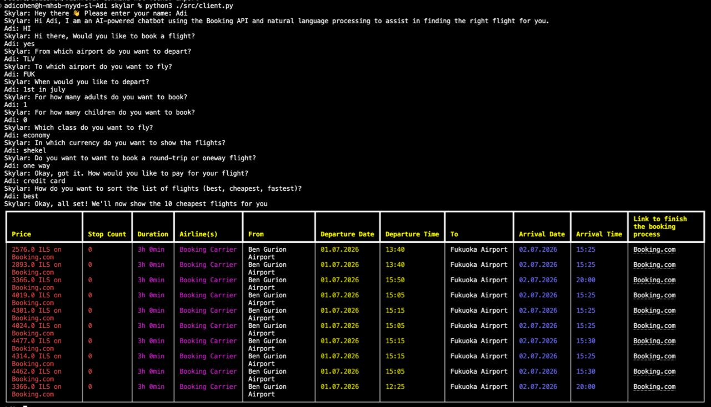
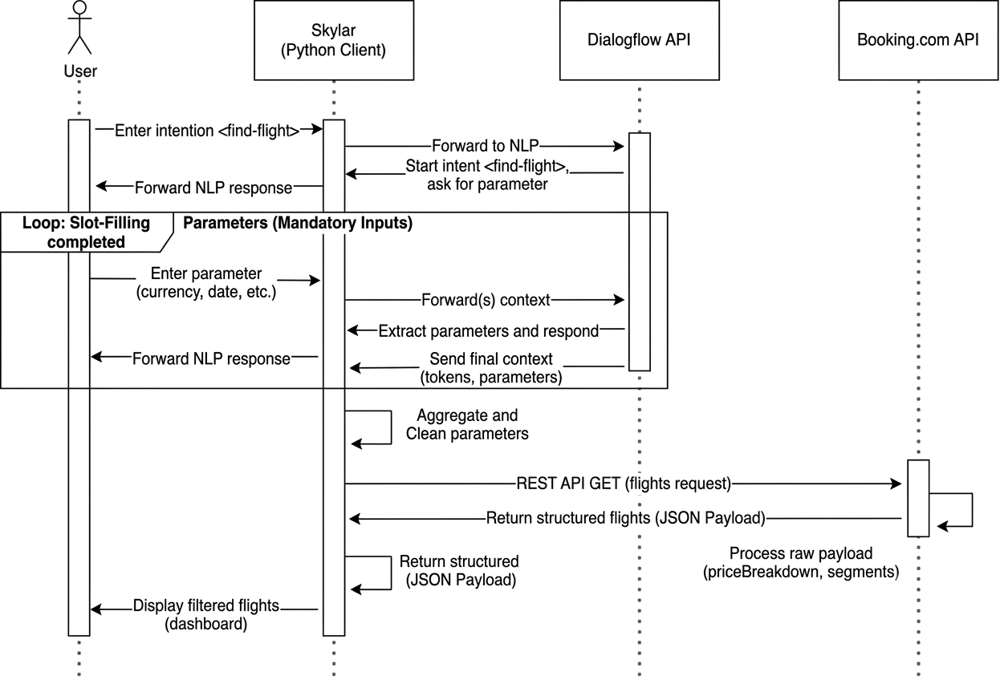
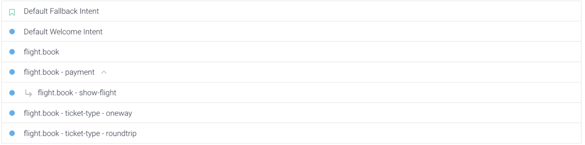
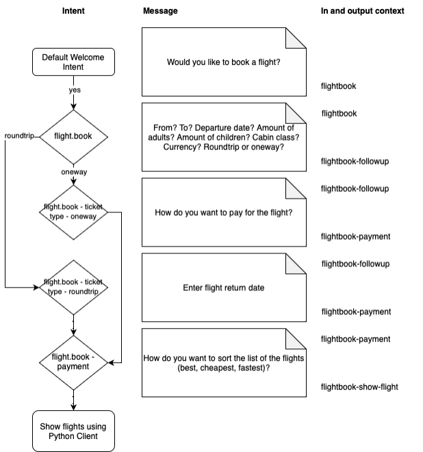
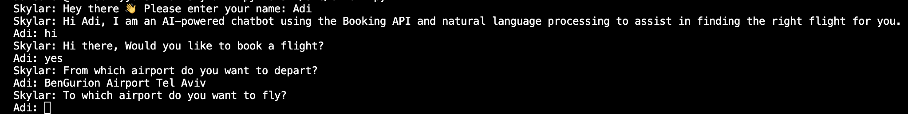
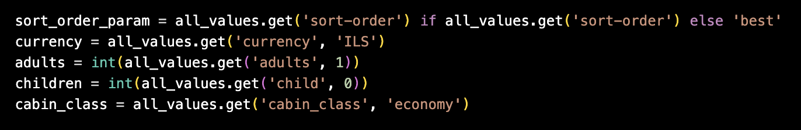
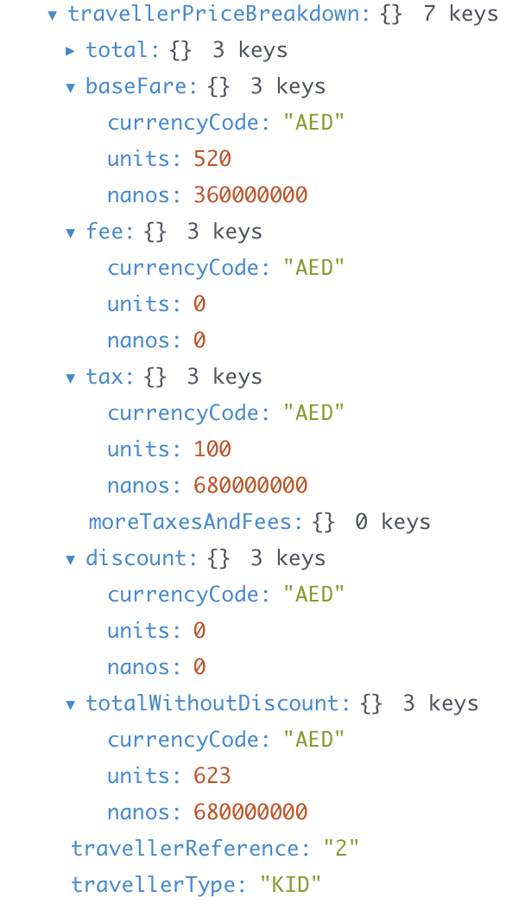

# Skylar

> Adi Cohen - 213526213, yonathan 

"Hi! I am an AI-powered chatbot using the Booking API and natural language processing to assist in finding the right flight for you."

This project was developed as part of the Natural Language Processing (NLP) course at the Holon Institute of Technology (HIT) during the Spring 2026 semester. It demonstrates the integration of Google Dialogflow ES, Python, and the Booking.com Flights API to create an intelligent travel assistant.

## Table of Contents

- [Introduction](#introduction)
  - [Functionality](#functionality)
  - [Conversation Snippet](#conversation-snippet)
- [Documentation](#documentation)
  - [Project Overview](#project-overview)
  - [Dialogflow Agent](#dialogflow-agent)
    - [Intents](#intents)
    - [Entities](#entities)
  - [Python Client](#python-client)
    - [Preprocess Parameters](#preprocess-parameters)
    - [Extracting Parameters from the NLP Response](#extracting-parameters-from-the-nlp-response)
  - [Booking API](#booking-api)
- [Discussion](#discussion)
  - [Dialogflow](#dialogflow)
  - [Closing Remarks](#closing-remarks)

## Introduction

Skylar is a conversational AI application that simplifies the process of searching for flights. Instead of manually navigating travel websites, users can simply chat with the assistant in natural language and provide the information needed to find suitable flights.

The chatbot is built using Google Dialogflow ES for natural language understanding and a Python client that communicates with the Skyscanner API to retrieve flight information.

The main objective of this project is to demonstrate how Natural Language Processing (NLP) can be integrated with external APIs to create an interactive and user-friendly travel assistant.

### Functionality

Skylar will ask you about all details needed, such as where you want to fly to, what your departure airport is, how many adults you wish to book the flight for etc. Then, it will present the ten most suitable flights for you, including their actual prices. On top of that, the user can choose between three different sorting options (best, cheapest, fastest) to get a better overview of the found flights. After choosing a flight, there's a deeplink the user may open to actually finish the booking and pay for the flight.

But why should anyone even bother using Skylar instead of using skyscanner.com directly? Websites (like skyscanner.com) are typically filled with ads and distracting content. Skylar just wants to help you with your flight, cuts out all the clutter and helps guide you through the process.

We envision being able to talk to Skylar to in the future to fully realize its potential and usability since talking is more convenient than typing.

### Conversation Snippet

Here is what a conversation with Skylar might look like:

## Documentation

### Project Overview

Skylar is made of three parts. The Python client is the frontend, which communicates with Dialogflow and Booking in the backend. Users will not notice any of the backend parts involved, but will only interact with Skylar through their terminal. The following diagram explains the procedure visually.

The user interacts with the Python client through a terminal. The input of the user is typically forwarded to Dialogflow to figure out its intent. Dialogflow's answer is then prompted to the user in the terminal of the Python client. Eventually, Skylar's Dialogflow part gathered all the info needed in order to perform a Booking API call. The Python client’s main task is to preprocess and orchestrate the data between the end user and the Booking API.

We will cover each part in greater detail in the following chapters.

### Dialogflow Agent

#### Intents

The preceding figure shows the intents configured to book a flight with Skylar on Dialogflow. The screenshot does not represent the structure of the intents well.

To find out more about how the intents work together, the following flowchart clarifies the intent structure as well as the purpose of each intent, including their in and output contexts.

During intent `flight.book`, Skylar will figure out most of the information needed to find suitable flights. Later on, other intents figure out additional information. These extra intents are required since we thought Skylar should understand the difference between a one-way and a round-trip flight. This way, if the user asks for a round-trip ticket, Skylar will also ask for a return date.

### Entities

Google Cloud Dialogflow utilizes advanced Named Entity Recognition (NER) to automatically detect, capture, and extract key structural variables from unstructured user text. Instead of requiring the Python client to parse complex conversational phrasing (e.g., converting dynamic relative expressions like *"tomorrow"* or *"next Friday"* into absolute values), Dialogflow's NLP engine normalizes these tokens into standardized, predictable data formats (such as compliant ISO-8601 timestamps). 

By outsourcing data validation to these native system entities, the system guarantees strict typing and seamless integration before compiling the payload for external REST calls. Skylar relies on the following built-in system entities:

* **`@sys.number`** – Dynamically parses passenger counts (adults/children) into clean integers.
* **`@sys.date-time`** – Automatically normalizes natural language dates into query-ready timestamps.
* **`@sys.airport`** – Extracts geographical locations and directly maps airport names to their respective 3-letter IATA codes.
* **`@sys.currency-name`** – Identifies and captures standard ISO currency preferences (e.g., USD, ILS, EUR) for financial consistency.

### 🖥️ The Python Client (Core System Orchestrator)

The Python runtime engine (`client.py`) serves as the central stateful orchestrator of the entire system. It acts as an abstraction layer that seamlessly manages data pipeline transitions between the end-user's terminal interface, the remote Google Cloud Dialogflow NLP engine, and the downstream Booking.com REST APIs. By handling session states and response routing, the client ensures a fluid, event-driven user experience from the initial prompt to the final data rendering.

#### 👤 Session Personalization & Interface Lifecycle
Upon initialization, the client captures the user's identity to establish runtime session personalization. While non-functional regarding data processing, mapping the user's name establishes clear conversational ownership in the terminal logs, prepending the message author to every string injection in the console interface.

#### 🔄 Conversational Routing & API Triggering
Behind the scenes, the client handles asynchronous message forwarding to the Google Dialogflow API, abstracts the underlying cloud infrastructure, and maintains an organic chat flow. 

The conversation loop runs continuously until Dialogflow activates the targeted intent context (`flight_book-show_flight` / `execute_flight_search`). This structural token signal stops the text routing, shifts the client into data-acquisition mode, and triggers the live network request to the **Booking.com Flights API** wrapper. Once the parsed results are rendered in the console UI, the user is provided with deep-link hyperlinks to seamlessly redirect them to external booking agencies and complete the transaction.

#### ⚙️ Entity Normalization & Request Parameter Mapping

Due to the robust NLP capabilities of Google Cloud Dialogflow, native system entities (such as `@sys.date`, `@sys.number`, and custom developer entities) handle the bulk of data validation and formatting automatically, eliminating the need for heavy local preprocessing. Consequently, the Python client's main responsibility is orchestration—extracting these validated tokens from the dialog state and mapping them directly to the key-value structures required by our downstream REST API endpoints. This architectural separation keeps the client light and ensures a predictable data schema before executing the external network request.

#### Extracting Parameters from the NLP Response

All parameters are saved inside of a context. In order to get all parameters at once, the Python client iterates over all contexts and extracts their parameters.

## Booking.com API Integration
The flight aggregation core is dynamically powered by the live **Booking.com Flights API** via RapidAPI. Once the Dialogflow state engine satisfies all conversational slot-filling requirements, `client.py` extracts the sanitized parameters and invokes the `fetchFlights()` routine inside `ApiHandler.py`. 

This specialized wrapper executes an authenticated RESTful HTTP `GET` request populated with live travel markers (IATA airport codes, cabin classes, local currencies, and structured timestamps). The engine handles a highly nested upstream JSON response, programmatically traversing complex arrays to map critical distributed data points—such as multi-segment flight legs, airline carrier metadata, baggage configurations, and exact currency breakdowns (`priceBreakdown.totalRounded`)—directly into our terminal interface layer.

## Discussion

### Dialogflow

Google's Dialogflow is a good fit for this project since it's well-documented, there are lots of tutorials, and it is relatively mature.

We have learned that in Dialogflow, newly learned parameters are to be found under "Action and Parameters". Contexts are used to structure the intent sequence and to pass the newly learned parameters from one intent to the next.

We had to learn the hard way that changing the context parameters will mess up the visual representation of the intent structure. Re-entering the previous context parameters won't bring the visualization back, follow up intents will only be displayed as regular intents from that point on, even though its structure logic remains the same. This has been a bit unlucky for our fancy screenshot for this documentation.

This was when we first noticed the flaws of the tool. Google's Dialogflow seems to be struggling to understand nuances and sometimes likes to fall back to its default intent quickly. We eventually figured out why and were able to minimize the occurrence, though we would wish for Dialogflow to be a bit smarter than that.

With that being said, realizing a project like this would have been impossible by only having the Python client, which made us once again realize the value of a tool like Dialogflow and AI in general.

## Closing Remarks

Contrary to our initial beliefs, the capabilities of AI in the form we are using it (Google Cloud Dialogflow) are still relatively limited. Making sure all the components work well together poses another set of challenges and limitations, since in our case we are basically limited to the exact data structures that the Booking.com API requires. This, of course, was predetermined by the architecture we chose to use.

Nevertheless, chatbots in general have great potential because they can extract intent out of natural language, which is undoubtedly helpful and saves a lot of manual clicking and navigating through an application or a terminal. We see natural language processing as most valuable when actually speaking to a bot instead of typing (e.g., Google Assistant, Siri).

It has been exciting for us to explore Google Cloud Platform. Looking back, we definitely learned a lot, and we are very happy with the final results of our work.